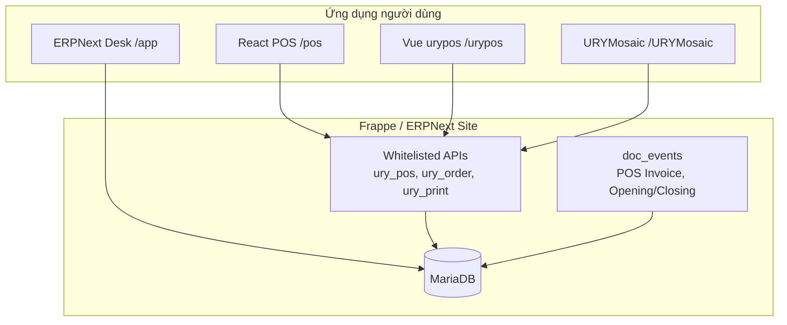
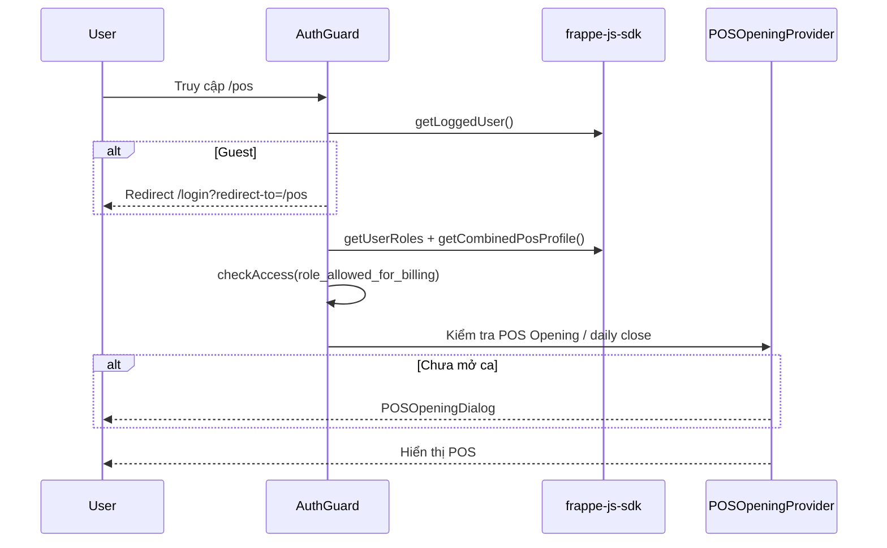
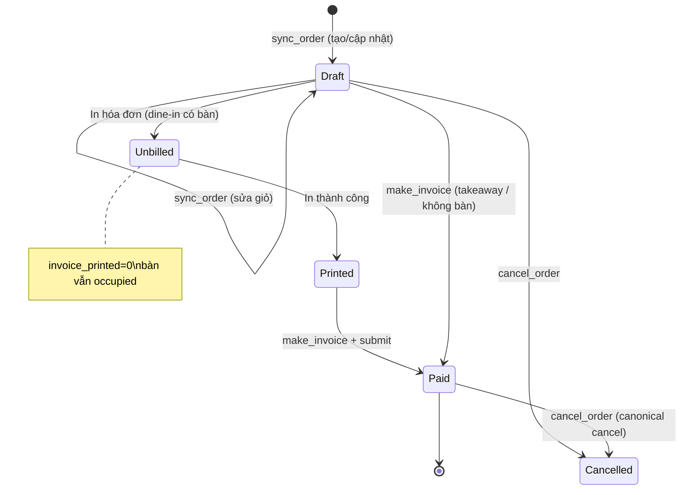
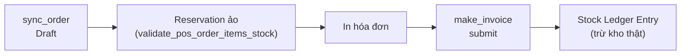
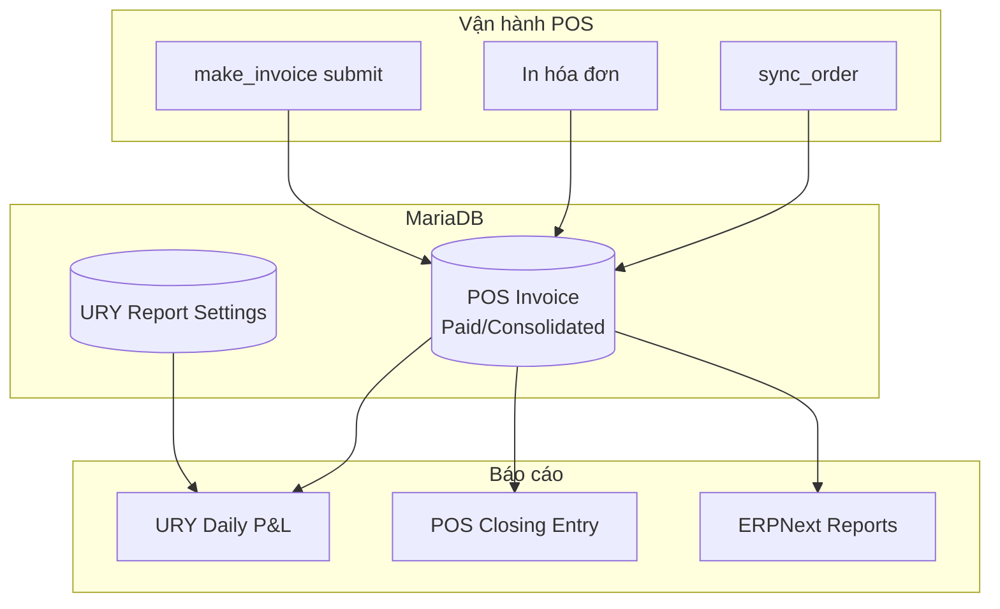

# Phân tích quy trình làm việc & báo cáo doanh thu — URY Restaurant POS

> Tài liệu mô tả **sản phẩm đã triển khai** (URY trên ERPNext v15 + HRMS), dựa trên mã nguồn trong repo `frappe_docker_fork` (`_ury_src/ury`, `_ury_src/pos`) và hướng dẫn vận hành `URY_INSTALL_GUIDE.md`, `SALES_LOGIC_QA_CHECKLIST.md`.

---

## 1. Tổng quan sản phẩm

**URY (URY Restaurant Management System)** là giải pháp quản lý nhà hàng xây trên **Frappe Framework / ERPNext**, gồm:

| Thành phần | Mô tả |
|------------|--------|
| **POS (bán hàng)** | Ghi đơn, in tạm tính, thu tiền, quản lý bàn |
| **KDS (Kitchen Display)** | Hiển thị đơn bếp qua `URYMosaic` |
| **ERPNext Desk** | Cấu hình master data, báo cáo, kế toán |
| **HRMS** | Nhân sự (tích hợp chi phí nhân công trong P&L) |

**Nguồn dữ liệu giao dịch chính:** DocType chuẩn ERPNext **`POS Invoice`** (không có DocType đơn hàng riêng cho billing). Mọi đơn POS đều map 1:1 với một POS Invoice.

**Stack triển khai (repo này):**

- Image Docker custom: ERPNext v15 + HRMS v15 + `ury_fork` (branch `develop`) — xem `apps.json`
- Frontend POS mới: React SPA tại **`/pos`** (`_ury_src/pos`)
- Frontend POS legacy: Vue tại **`/urypos`** (`_ury_src/urypos`)
- Backend: `_ury_src/ury`

---

## 2. Kiến trúc tổng thể



| URL | Ứng dụng |
|-----|----------|
| `/pos` | React POS (sản phẩm mới trong fork) |
| `/urypos` | Vue POS (mặc định trong hướng dẫn cài đặt) |
| `/app` | ERPNext Desk — cấu hình & báo cáo |
| `/URYMosaic/<unit>` | Kitchen Display System |

> **Lưu ý:** URL `/pos` của ERPNext Standard POS là app khác, khác permission. URY dùng `/urypos` hoặc React POS tại `/pos` (đã đăng ký route trong `hooks.py`).

---

## 3. Vai trò & phân quyền

### 3.1 Vai trò chính

| Role | Trách nhiệm |
|------|-------------|
| **URY Cashier** | Thu ngân — thao tác POS hàng ngày |
| **System Manager** | Cấu hình master data, quyền, POS Profile |
| **Waiter / Captain** | Ghi order (field `waiter` trên invoice) |
| **Main cashier / Sub cashier** | Mở/đóng ca khi bật multi-cashier |

### 3.2 Ràng buộc quan trọng

1. **Không dùng user `Administrator` cho POS** — `getBranch()` resolve branch qua bảng `URY User`; Administrator không có branch → lỗi "POS Profile not found".
2. User phải có ít nhất một role trong **`POS Profile → role_allowed_for_billing`** (kiểm tra ở `AuthGuard.tsx`).
3. User phải được gắn **Branch** qua DocType **URY User** (child table của Branch).

### 3.3 Luồng xác thực (React POS)



**File liên quan:**

- `_ury_src/pos/src/components/AuthGuard.tsx`
- `_ury_src/pos/src/components/POSOpeningProvider.tsx`
- `_ury_src/pos/src/lib/pos-profile-api.ts`
- `_ury_src/ury/ury_pos/api.py` — `getPosProfile`, `getBranch`

---

## 4. Quy trình vận hành hàng ngày

### 4.1 Chuẩn bị đầu ngày (Desk / quản lý)

Thứ tự setup master data (chi tiết: `URY_INSTALL_GUIDE.md`):

1. **Company** → **Branch** → gắn user vào **URY User**
2. **URY Restaurant** — menu, thuế, prefix hóa đơn
3. **URY Menu** + **Item Price** (price list theo nhà hàng/phòng/loại đơn)
4. **POS Profile** — warehouse, payment modes, printer, rooms
5. **URY Report Settings** — giờ business day, buying price list (cho COGS/P&L)
6. **URY Table** / **Rooms** — sơ đồ bàn

### 4.2 Mở ca (đầu ca thu ngân)

| Bước | Hành động | DocType / API |
|------|-----------|---------------|
| 1 | Thu ngân đăng nhập `/pos` hoặc `/urypos` | Session Frappe |
| 2 | Hệ thống kiểm tra **POS Opening Entry** chưa có | `ury.ury_pos.api.posOpening` |
| 3 | Tạo & submit **POS Opening Entry** (status = Open) | ERPNext standard |
| 4 | Chọn đúng **Rooms** trong Opening Entry | Bắt buộc — nếu thiếu room, bàn không hiện |

**Ràng buộc multi-cashier:**

- Main cashier phải mở ca trước sub-cashier (`custom_enable_multiple_cashier`)
- Sub-cashier phải đóng **Sub POS Closing** trước khi main đóng ca chính

**Kiểm tra đóng ca ngày trước:**

- Nếu `POS Profile.custom_daily_pos_close = 1`, `validate_pos_close` chặn POS khi ca hôm trước vẫn Open (`POSOpeningProvider.tsx`).

### 4.3 Vận hành trong ca

| Màn hình | Route | Chức năng |
|----------|-------|-----------|
| **Menu / Takeaway** | `/pos` | Bán mang đi, aggregator — không cần bàn |
| **Bàn** | `/pos/table` | Chọn phòng → bàn → order dine-in |
| **Đơn hàng** | `/pos/orders` | Danh sách Draft / Unbilled / Paid, in, thanh toán, hủy |

### 4.4 Đóng ca (cuối ca)

1. Đối soát tiền mặt / phương thức thanh toán
2. Tạo **POS Closing Entry** (và **Sub POS Closing** nếu multi-cashier)
3. Submit — đối chiếu với POS Invoice trong kỳ mở ca

### 4.5 Cuối ngày — báo cáo quản lý

1. Tạo **URY Daily P&L** cho branch + ngày kinh doanh
2. Nhập điện năng, vật tư tiêu hao (nếu có)
3. Submit → hệ thống tính gross/net sales, COGS, chi phí, lợi nhuận

---

## 5. Vòng đời đơn hàng (Order lifecycle)

Đây là **luồng nghiệp vụ cốt lõi** của sản phẩm.

### 5.1 Sơ đồ trạng thái



### 5.2 Các bước chi tiết

#### Bước 1 — Tạo / cập nhật đơn nháp: `sync_order`

| Thuộc tính | Giá trị |
|------------|--------|
| API | `ury.ury.doctype.ury_order.ury_order.sync_order` |
| Frontend | `OrderPanel.tsx` → `order-api.ts` |
| DocType | `POS Invoice`, `docstatus = 0`, `status = Draft` |

**Hệ thống thực hiện:**

- Tạo mới hoặc cập nhật POS Invoice từ giỏ hàng
- Lấy giá từ **Item Price** theo **URY Menu** + price list (theo restaurant/room/order type/aggregator)
- **Kiểm tra tồn kho ảo:** `validate_pos_order_items_stock()` — trừ `Bin.actual_qty` và các draft POS khác cùng warehouse
- **Bảo vệ đồng thời:** so sánh `last_modified_time` với `invoice.modified` → trả `Failure` nếu stale
- **Dine-in:** set `URY Table.occupied = 1` khi chưa in
- **KOT:** `kot_execute()` — lỗi KOT được log, không chặn lưu đơn
- Thêm **dummy payment** lần đầu (`invoice_created` flag)

#### Bước 2 — In tạm tính (bắt buộc với dine-in có bàn)

| Thuộc tính | Giá trị |
|------------|--------|
| API in | `ury.api.ury_print` (QZ / network / socket) |
| Frontend | `print.ts`, `print-qz.ts`, `invoice-api.ts` |

**Sau khi in thành công (đơn có bàn):**

- `invoice_printed = 1`
- `URY Table.occupied = 0` — **nhả bàn** (khách có thể rời, thu ngân thu tiền sau)

**Hook ERPNext:** `before_submit` trên POS Invoice — nếu có `restaurant_table` mà `invoice_printed = 0` → **throw**, không cho submit.

```python
# ury/hooks/ury_pos_invoice.py — validate_invoice_print
if doc.restaurant_table and invoice_printed == 0:
    frappe.throw("Printing the invoice is mandatory before submitting...")
```

**UI:** Nút thanh toán bị khóa cho đến khi `invoice_printed === 1` (`Orders.tsx`).

#### Bước 3 — Thanh toán & ghi nhận doanh thu: `make_invoice`

| Thuộc tính | Giá trị |
|------------|--------|
| API | `ury.ury.doctype.ury_order.ury_order.make_invoice` |
| Frontend | `PaymentDialog.tsx` |

**Luồng:**

1. Thay thế child table `payments` bằng split tender (Cash, Card, …)
2. Áp dụng `additional_discount_percentage` (nếu có)
3. Re-validate stock
4. `save()` → `submit()` → `docstatus = 1`, `status = Paid`
5. **Trừ kho thật** (`update_stock = 1`) — Stock Ledger Entry

#### Bước 4 — Hủy đơn: `cancel_order`

| Trạng thái invoice | Hành vi |
|--------------------|---------|
| Draft (`docstatus = 0`) | Cancel thủ công + nhả bàn + hủy KOT |
| Submitted (`docstatus = 1`) | `pos_invoice.cancel()` — ERPNext canonical |
| Mọi trường hợp | **Bắt buộc có `reason`** |

### 5.3 Ma trận trạng thái hiển thị trên POS

| UI Status | Điều kiện SQL (tóm tắt) |
|-----------|-------------------------|
| **Draft** | `status = Draft` AND (đã in OR không có bàn) |
| **Unbilled** | `status = Draft` AND có bàn AND `invoice_printed = 0` |
| **Recently Paid** | `status = Paid` (giới hạn `paid_limit`) |
| **Paid / Consolidated / Return** | Khi bật `view_all_status` |

> Chi tiết kiểm thử: `SALES_LOGIC_QA_CHECKLIST.md`

### 5.4 Các nghiệp vụ phụ

| Nghiệp vụ | API |
|-----------|-----|
| Chuyển bàn | `table_transfer` |
| Chuyển captain/waiter | `captain_transfer` |
| Món yêu thích khách | `customer_favourite_item` |
| Đơn Aggregator | `order_type = Aggregators` — price list từ **Aggregator Settings** |

---

## 6. Quản lý tồn kho trong luồng bán



| Giai đoạn | Hành vi |
|-----------|---------|
| Draft | Trừ tồn ảo — các draft khác cùng warehouse được tính |
| Submit (Paid) | Ghi SLE, `update_stock = 1` |
| Menu refresh | `available_qty` cập nhật sau mỗi lần sync thành công |

---

## 7. Phương thức thanh toán

| Nguồn | Cách lấy |
|-------|----------|
| **POS Profile → payments** | `getModeOfPayment()` → `payment-api.ts` |
| **Mặc định UI** | `Cash` |
| **Aggregator** | `getAggregatorMOP(aggregator)` từ Branch settings |
| **Split tender** | `make_invoice` nhận mảng `{mode_of_payment, amount}` |

**Đơn Aggregator đặc biệt:** Branch `custom_make_unpaid = 1` có thể chuyển sang **Sales Invoice** chưa thanh toán (`ury_sales_invoice.py`).

---

## 8. Báo cáo doanh thu

### 8.1 Nguồn dữ liệu doanh thu

Mọi báo cáo doanh thu chính đều đọc từ **`tabPOS Invoice`** với điều kiện:

```sql
branch = :branch
AND status IN ('Paid', 'Consolidated')
AND docstatus = 1
```

**Không tính:** Draft, Cancelled, Return (trừ khi báo cáo riêng).

### 8.2 Business day — URY Report Settings

Doanh thu **không luôn** theo `posting_date` lịch — phụ thuộc **URY Report Settings** theo branch:

| Cấu hình | Ý nghĩa |
|----------|---------|
| `hours = 0` hoặc NULL | Doanh thu theo `posting_date` |
| `hours > 0` (vd: 5) | Business day từ 05:00 ngày D đến 04:59 ngày D+1 |

Logic SQL (trích từ `ury_daily_p_and_l.py`):

```sql
-- Khi hours > 0:
TIMESTAMP(posting_date, posting_time) >= TIMESTAMP(date, '05:00:00')
AND TIMESTAMP(posting_date, posting_time) <= TIMESTAMP(DATE_ADD(date, 1 DAY), '05:00:00')
```

### 8.3 Báo cáo chính: URY Daily P&L

**DocType:** `URY Daily P&L`  
**File:** `_ury_src/ury/ury/doctype/ury_daily_p_and_l/ury_daily_p_and_l.py`

Khi **submit**, hệ thống tự tính:

| Chỉ số | Công thức / nguồn |
|--------|-------------------|
| **Gross Sales** | `SUM(grand_total)` từ POS Invoice Paid/Consolidated |
| **Cash Discount + Round Off** | `rounded_total - paid_amount + change_amount` + round off |
| **Tax** | `grand_total - net_total` |
| **Net Sales** | Gross − Discount/RoundOff − Tax |
| **COGS** | Qty bán × giá mua (buying price list từ Report Settings); hỗ trợ BOM lồng, Product Bundle |
| **Direct expenses** | Điện, vật tư tiêu hao nhập trên form |
| **Employee costs** | Attendance + wage rules (HRMS) |
| **Indirect expenses** | Template chi phí gián tiếp |
| **Gross Profit** | Net Sales − COGS − Direct Expenses |
| **Net Profit** | Gross Profit − Employee − Indirect − Depreciation |

**Cảnh báo khi thiếu giá mua:** Document ghi `remarks` liệt kê item chưa có Item Price trên buying price list — vẫn submit được nhưng COGS có thể thiếu.

### 8.4 Báo cáo vận hành POS (không phải P&L đầy đủ)

| API | Mục đích |
|-----|----------|
| `getPosInvoice` | Danh sách đơn theo status (Draft/Unbilled/Paid) |
| `searchPosInvoice` | Tìm theo tên KH / SĐT / mã HĐ |
| `getPosInvoiceItems` | Chi tiết dòng + thuế |
| `getInvoiceForCashier` | Đơn theo cashier đang mở ca |

### 8.5 Báo cáo ERPNext chuẩn (Desk)

| Báo cáo / DocType | Ứng dụng |
|-------------------|----------|
| **POS Closing Entry** | Đối soát tiền cuối ca vs POS Invoice |
| **Sales Register / POS Invoice List** | Tra cứu hóa đơn |
| **Stock Ledger / Bin** | Tồn kho sau bán |
| **Sales Invoice** | Đơn Aggregator (khi `custom_make_unpaid`) |

### 8.6 Script kiểm tra nhanh

```bash
# Trong container bench
bench --site <site> execute ury.tests.verify_ury_flows.run_all_checks
```

Kiểm tra: Report Settings tồn tại, mix status invoice, stock bins.

---

## 9. Luồng báo cáo doanh thu (tổng hợp)



**Timeline trong ngày kinh doanh:**

| Thời điểm | Hoạt động | Ảnh hưởng báo cáo |
|-----------|-----------|-------------------|
| Mở ca | POS Opening Entry | Phạm vi invoice thuộc ca |
| Trong ca | sync → in → make_invoice | Tạo POS Invoice Paid |
| Đóng ca | POS Closing Entry | Đối soát tiền |
| Cuối ngày | URY Daily P&L submit | Gross/Net sales, COGS, profit |

---

## 10. Tích hợp ERPNext / Frappe

| Domain | Tích hợp |
|--------|----------|
| **Billing** | POS Invoice + custom fields (table, branch, restaurant, waiter, `invoice_printed`, aggregator…) |
| **Stock** | `update_stock=1`; reservation trên draft |
| **Pricing** | Price List ↔ URY Menu; aggregator price lists |
| **Tax** | `URY Restaurant.default_tax_template`; Branch `custom_no_taxes` |
| **Kitchen** | URY KOT + realtime + URYMosaic |
| **Print** | Print Format trên POS Profile; QZ Tray / CUPS / browser |
| **Hooks** | `doc_events` trên POS Invoice, Opening/Closing, Sales Invoice |

---

## 11. Bản đồ file mã nguồn quan trọng

### Frontend — `_ury_src/pos/`

| File | Vai trò |
|------|---------|
| `src/App.tsx` | Router: `/`, `/orders`, `/table` |
| `src/components/AuthGuard.tsx` | Session + role gate |
| `src/components/POSOpeningProvider.tsx` | Gate mở/đóng ca |
| `src/components/OrderPanel.tsx` | Giỏ → `sync_order` |
| `src/components/PaymentDialog.tsx` | `make_invoice` |
| `src/pages/Table.tsx` | Phòng/bàn, in, mở POS |
| `src/pages/Orders.tsx` | DS đơn, in, pay, cancel |
| `src/lib/order-api.ts` | `sync_order`, `get_order_invoice` |
| `src/lib/invoice-api.ts` | List, print HTML |
| `src/lib/pos-opening-api.ts` | `posOpening`, `validate_pos_close` |

### Backend — `_ury_src/ury/`

| File | Vai trò |
|------|---------|
| `ury_pos/api.py` | Branch, menu, invoice list, profile, opening |
| `ury/doctype/ury_order/ury_order.py` | `sync_order`, `make_invoice`, `cancel_order` |
| `ury/hooks/ury_pos_invoice.py` | In-before-submit, table release |
| `ury/hooks/ury_pos_opening_entry.py` | Validation mở ca |
| `ury/hooks/ury_pos_closing_entry.py` | Validation đóng ca |
| `ury/doctype/ury_daily_p_and_l/ury_daily_p_and_l.py` | **Báo cáo P&L ngày** |
| `ury/api/ury_print.py` | In + set `invoice_printed` |
| `ury/api/ury_kot_generate.py` | Tạo KOT |

### Tài liệu & script repo gốc

| File | Vai trò |
|------|---------|
| `URY_INSTALL_GUIDE.md` | Triển khai Docker + master data |
| `SALES_LOGIC_QA_CHECKLIST.md` | Ma trận QA luồng bán |
| `setup_cashier.py` | Fix quyền đọc POS Profile cho URY Cashier |
| `apps.json` | Build image: erpnext + hrms + ury_fork |

---

## 12. Checklist vận hành sản phẩm

### Thu ngân (mỗi ca)

- [ ] Đăng nhập đúng user URY Cashier (không phải Administrator)
- [ ] Mở **POS Opening Entry** với đúng Rooms
- [ ] Dine-in: **In trước → Thu tiền sau**
- [ ] Đóng ca: **POS Closing Entry** / Sub Closing nếu multi-cashier

### Quản lý (cuối ngày)

- [ ] Kiểm tra **URY Report Settings** (hours, buying price list)
- [ ] Tạo & submit **URY Daily P&L**
- [ ] Xử lý `remarks` thiếu giá mua (Item Price)
- [ ] Đối chiếu POS Closing vs tổng Paid invoices

### Kỹ thuật (sau deploy)

- [ ] Build assets: `bench build --apps ury`
- [ ] Smoke: `verify_ury_flows.run_all_checks`
- [ ] React build: `cd _ury_src/pos && npm run build`

---

## 13. Rủi ro & điểm cần lưu ý khi vận hành

| Rủi ro | Mô tả | Giảm thiểu |
|--------|--------|------------|
| Stale edit | Hai thu ngân sửa cùng đơn | UI reload khi `last_modified_time` lệch |
| Submit không in (dine-in) | Hook chặn submit | Luồng UI khóa nút Pay |
| Thiếu COGS | Item chưa có buying price | Xem `remarks` trên Daily P&L |
| Sai business day | `hours` Report Settings sai | Cấu hình lại + re-submit P&L |
| Administrator dùng POS | Không resolve branch | Tạo user cashier riêng |
| KOT lỗi | App KOT không cài | Đơn vẫn lưu; kiểm tra error log |

---

## 14. Tóm tắt

**URY** sau khi đưa vào sản phẩm vận hành theo mô hình:

1. **Master data** trên Desk (Branch, Restaurant, Menu, POS Profile, Report Settings)
2. **Mở ca** → **Bán hàng** (draft → in → thanh toán) → **Đóng ca**
3. **Doanh thu được ghi nhận** khi POS Invoice **submit Paid** — đây là sự kiện kế toán & tồn kho
4. **Báo cáo doanh thu chính** là **URY Daily P&L**, aggregate từ POS Invoice theo branch và business day (URY Report Settings)
5. **Báo cáo ca** là POS Closing Entry; **báo cáo Desk** bổ sung tra cứu chuẩn ERPNext

Frontend React tại `/pos` và Vue tại `/urypos` dùng chung backend API — khác biệt chủ yếu ở UX, không thay đổi logic nghiệp vụ cốt lõi.

---

*Tài liệu được tổng hợp từ mã nguồn `_ury_src` trong repo `frappe_docker_fork`. Cập nhật khi nâng cấp branch `ury_fork`.*
